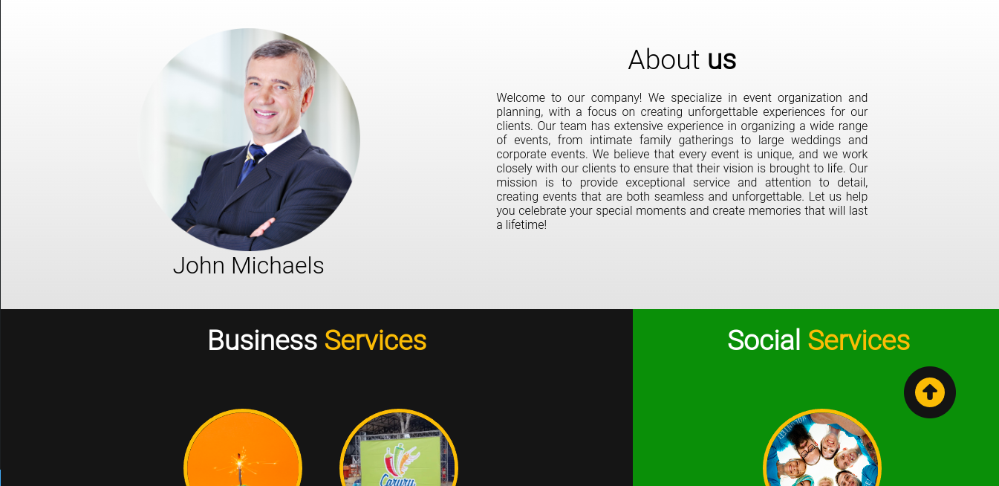
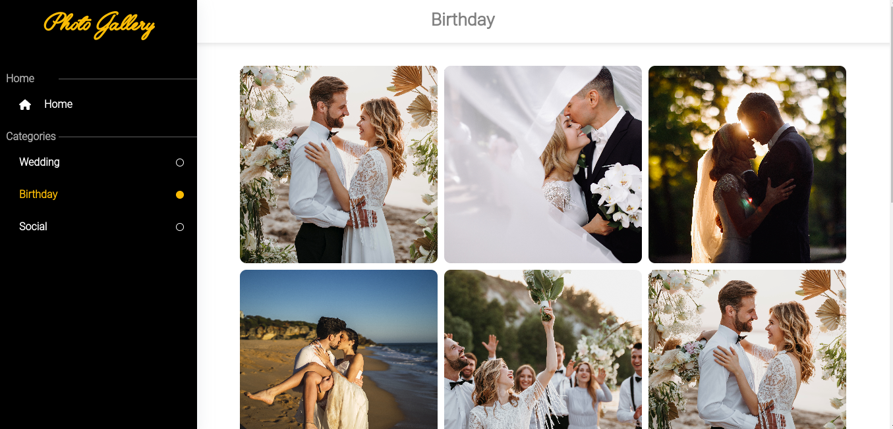
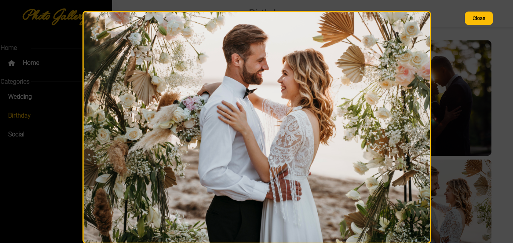

# React + Express Website

This is a SPA freelancing website model which was primarily designed for a client operating in event planning industry, with a particular focus on providing high-quality lighting services.

Some information in this code was changed to preserve the company's copyright of its content. All images and text are samples.

In the following sections, I`ll dive deeper into the features and functionalities of the website, and provide instructions on how to use them.

**See the real website here**: https://gbiluminacoes.com.br

## Features

* The website has two pages: The homepage which is a landing page and a gallery of photos.
  
* Images are fetched from Cloudinary using the Cloudinary API and displayed in a responsive grid layout.
  
* Users can click on individual images to view a larger version of the image in a modal.
  
* The website has an infinite scroll feature that loads more images as the user scrolls down.

* The backend is built with Express.js and handles API requests to Cloudinary to fetch images.

## Screenshots


<br/>
<br/>

<br/>
<br/>

<br/>
<br/>

<br/>
<br/>

<br/>
<br/>

## Technologies


## Installation

* Clone the repository to your local machine.
* Navigate to the project directory in your terminal.
* Run ``npm install`` to install all required dependencies.
* Create a .env file in the frontend directory and add the following environment variables:

```env
REACT_APP_API_PATH=<your Express.js API URL>
REACT_APP_API_KEY=<A string that the backend will validate as Authorization in Headers>
```

* Create another .env file in the backend directory with the following enviroment variables:

```env
CLOUDINARY_API_KEY=<your Cloudinary API key>
CLOUDINARY_API_SECRET=<your Cloudinary API secret>
CLOUDINARY_CLOUD_NAME=<your Cloudinary cloud name>
```

* Run ``npm start`` in frontend directory or ``npm run dev`` in backend directory to start the development server.

## Usage

* Navigate to localhost:8080 in your web browser.
* Browse the homepage and click in "View gallery" in services section to browse and interact with the image gallery.
* Scroll down to load more images.
* Change category in the left sidebar.

## License

This project is licensed under the MIT License - see the LICENSE.md file for details.

## Acknowledgments

* Cloudinary for providing the API that allows this website to fetch images.
* React Lazy Load Image Component for the lazy loading functionality used in the image gallery.
* React Infinite Scroll Component for the infinite scroll functionality used in the image gallery.